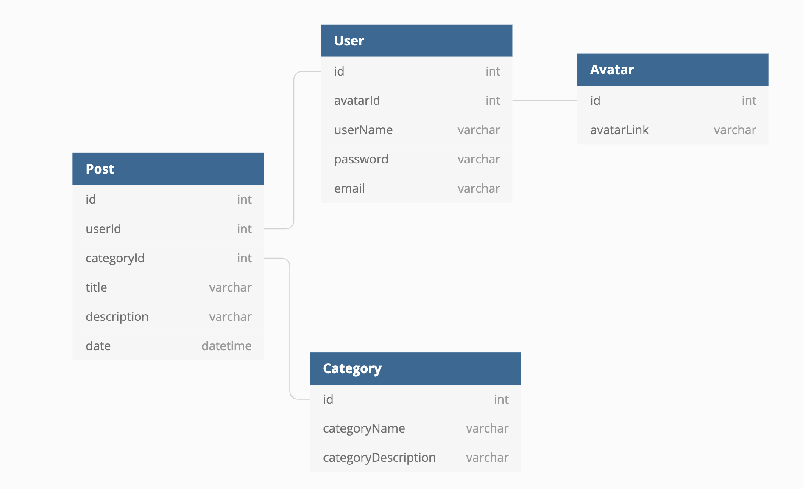
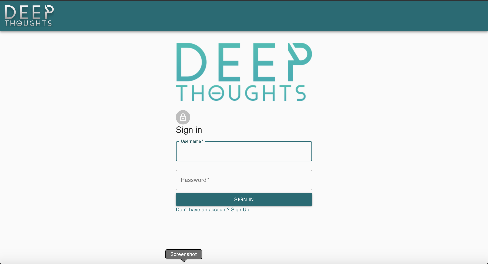
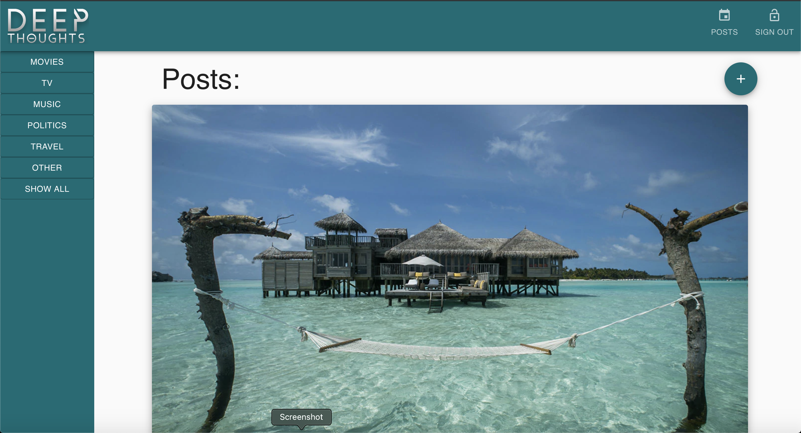

# NSS Front End Capstone: "Deep Thoughts"

### Overview:

I created a single page application that utilzies the following:

1. JavaScript
2. React.js
3. JSON for database
4. Material-UI and CSS for styling

### Technologies Used:

1. HTML5, CSS3, JavaScript, React, Git, npm
2. [React 16.8.6](https://reactjs.org/docs/getting-started.html): Core app functionality
3. [Material-UI](https://material-ui.com/): Styling library
4. [JSON Server](https://github.com/typicode/json-server): Fake REST API to run mock back end server

### Final Product:

**"Deep Thoughts" is a bolgging application for the users to share their thoughts throgh the blogs and get the good and easy user experience**

> Allow users to sign in and sign up.

> Allow users to select different given avatar/emoji for their user registration.

> Allow users to see/read all blogs from other users when they logged in.

> Allow users to add new blogs when they logged in.

> Allow users to edit/delete their own blogs.

> Allow users to see their blogs stand out differently in all blogs.

> Allow users to filter blogs by category from given categories.

> Allow users to see the most recent uploaded blogs on top of all blogs.

> Allow users to sign out.

### Entity Relationship Diagram of the database:

#### Login view

#### Main app view

### How to run application:

1. Ensure you have npm installed on your machine
2. Ensure you have json-server installed on your machine
3. Clone the project and run **npm install**
4. Run the command **json-server api/database.json -p 8088** to run the json-server on http://localhost:8088
5. In a seperate terminal tab run **npm start** The application will run on http://localhost:3000

### Contributor:

[DEEP PATEL](https://github.com/Deep-A-Patel)
